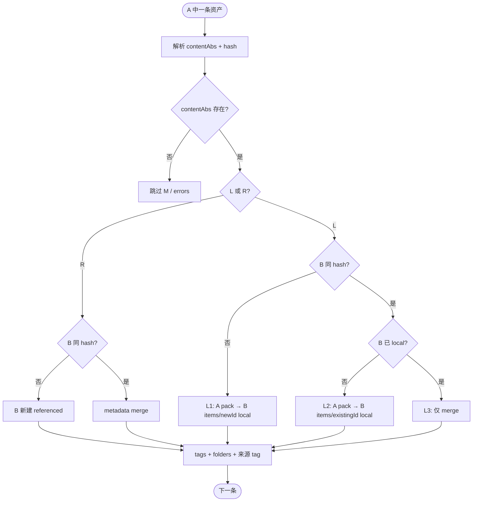

# 索引库 → 索引库（同机）整库导入 — 完整方案

> **状态**：已实现（CC-V1）  
> **版本**：CC-V1  
> **代号**：CC（Catalog → Catalog）  
> **范围**：仅 **catalog 源库 A → catalog 目标库 B**，且 **同一台机器、同一用户环境**  
> **关联**：[library-import-from-library-spec.md](./library-import-from-library-spec.md)（archive→archive · LIM V1）

---

## 1. 背景与目标

### 1.1 背景

用户常有两个**索引库（catalog）**，在 A 中已整理标签、文件夹、notes，希望**合并到 B**，且：

- 同机环境下，外部引用路径大多仍有效，不必像 archive 导入那样默认整包拷贝。
- 部分资产在 A 中已 **本地化**（`items/{id}/` 有主文件），合并到 B 时应形成或补全 B 的本地副本，而不是仅留引用。
- 若 B 已有相同内容（hash）的引用，应用 A 的本地 pack **补本地化 B**，而不是重复新建行。

现有能力缺口：

| 能力 | 问题 |
|------|------|
| LIM V1（archive→archive） | 拒绝 catalog 源；策略是拷 `items/` |
| `copyAssetsToOtherLibrary` | 选中资产跨库复制（含文件夹、标签、`type_id`）；**无**整库去重，非整库合并 |
| 单条 `localizeOneAsset` | 仅针对当前库 B 的引用路径，**不能**指定 A pack 为源 |

### 1.2 目标

一次后台任务，将 **A 全部资产** 的元数据合并进 B，并按资产类型与 hash 状态决定：

- **引用合并**（R）：B 新增或 merge，主文件用绝对路径引用，不占盘。
- **本地化导入**（L1）：B 无同 hash → 从 A pack 拷入 B `items/`。
- **补本地化**（L2）：B 有同 hash 但为引用 → 用 **A pack** 本地化 B 已有条。
- **去重跳过**（L3）：B 有同 hash 且已 local → 仅 merge 元数据。

附加：来源库 **displayName tag**、文件夹树、**用户分类定义与 type_id**、SHA-256 去重，与 LIM V1 一致。

### 1.3 非目标

- 跨机 / 换用户 / NAS 盘符变更后的路径保证
- catalog → **archive**（目标必须为 catalog）
- **archive** 作源库（走 LIM V1）
- 只导入 A 的部分文件夹（后续 CC-V2）
- 导入后修改或删除源库 A
- 导入进度 HTTP SSE（可后续与 LIM 共用 job API）

---

## 2. 前置条件

| 项 | 要求 |
|----|------|
| 源库 A | 含 `manifest.json` + `library.sqlite`；`libraryMode === 'catalog'` |
| 目标库 B | 当前活动库；`getLibraryMode() === 'catalog'` |
| 路径 | `normalize(A) ≠ normalize(B)` |
| 同机 | 预检与导入时，拟用 `contentAbs` 在 `existsSync` 意义下可读（软保证） |
| 源库写入 | 建议 A 无其它进程写入；实现侧 A 的 SQLite **readonly** |

### 2.1 错误码

| code | HTTP | 说明 |
|------|------|------|
| `INVALID_PATH` | 400 | 非有效资料库目录 |
| `INVALID_SOURCE_MODE` | 400 | A 为 archive |
| `TARGET_NOT_CATALOG` | 409 | B 非 catalog |
| `SAME_LIBRARY` | 400 | A 与 B 路径相同 |
| `SOURCE_NOT_FOUND` | 404 | 路径不存在 |
| `SOURCE_DB_ERROR` | 503 | 无法只读打开 A 的 DB |
| `LIBRARY_BUSY` | 409 | 已有导入任务 |
| `SOURCE_ALL_MISSING` | 400 | 预检 L+R 均为 0（可选） |

---

## 3. 用户流程

```text
设置 → 资料库 → [从其它资料库导入…]
  → 选择源库 A 根目录
  → 系统识别：A、B 均为索引库 → 进入 CC 流程
  → 预检报告（§4）
  → 确认对话框（统计 + 风险说明 §13）
  → 后台导入（进度 IPC：validate → preflight → tags → categories → folders → assets → finalize）
  → 完成报告（§10）
  → 刷新 B 的列表与文件夹树
```

**与 LIM V1 分流**：

- A 或 B 为 archive → 走 [library-import-from-library-spec.md](./library-import-from-library-spec.md) 或提示切换库模式。

---

## 4. 预检 `preflightScan`

只读扫描 A 全部 `assets`，输出：

```typescript
type CatalogImportPreflight = {
  sourceDisplayName: string
  sourceMode: 'catalog'
  targetMode: 'catalog'
  totalAssets: number
  byKind: {
    localizedInA: number    // L
    referencedInA: number   // R
    missing: number         // M
  }
  estimatedAddedLocal: number      // 粗估 L1
  estimatedLocalizedOnImport: number // 粗估 L2（需 B hash 查表，可导入时再精确）
  warnings: string[]  // 如「N 条将依赖 A 库目录绝对路径」
}
```

**确认框必展示**：

- L / R / M 数量
- 「B 将依赖 A 目录及外部路径，请勿随意删除 A」
- 「A 已本地化条目会在 B 中尽量变为本地副本；B 已有同内容引用将自动本地化（源：A items pack）」

---

## 5. 来源库 tag（与 LIM V1 相同）

| 规则 | 说明 |
|------|------|
| Tag 名 | A 的 `manifest.displayName` trim；空则 A 文件夹 `basename` |
| 创建 | B 中按 `tags.name` 精确匹配复用，否则新建 |
| 关联 | 本批**触及**的所有资产（L1 新建、L2/L3/R 去重 merge）均打来源 tag |
| 与 A 原 tag | **叠加**（并集） |

---

## 6. 导入阶段

### 6.1 总览

```text
validateSourceCatalog
  → preflightScan
  → phaseTags          // 同 LIM V1
  → phaseCategories    // 同 LIM V1，用户分类按 name 合并
  → phaseFolders       // 同 LIM V1，按 folders.path 合并
  → phaseAssets        // §7–§9
  → phaseFinalize      // folder.asset_count、assets_search、notify UI
  → report
```

**打开源库 DB**：独立 `better-sqlite3` 连接，`readonly: true`；**不**切换 `getDatabase()`。

### 6.2 `phaseTags` / `phaseCategories` / `phaseFolders`

与 LIM V1 相同：

- Tag：`Map<sourceTagId, targetTagId>` 按 name 合并
- Category：`Map<sourceCategoryId, targetCategoryId>` 按 name 合并（用户分类）
- Folder：按 `path` 合并；`level ASC` 保证父先于子
- 不导入 A 的 `coverAssetId`（CC-V1 可省略，与 LIM 一致）

### 6.3 `phaseFinalize`

- 刷新 `folders.asset_count`
- `rebuildAssetSearchText` / 触发器维护的 `assets_search`
- `notifyAllWindowsAssetsImported()`、`library:import-complete`
- `flushDatabase()`

---

## 7. 资产分类（A 侧）

对 A 每条资产，解析 **内容文件绝对路径** `contentAbs`（对齐 `assetPathResolver` + `sourceRoot`）：

1. 若 `storage_mode === 'referenced'` 或 `file_path` 为绝对路径 → 先按绝对路径
2. 否则 `join(sourceRoot, file_path)`
3. 仍不存在 → 在 `join(sourceRoot, items/{id}/)` 找最大非 meta/thumb 文件
4. 皆无 → **M**

| 类型 | 判定 |
|------|------|
| **L** localized-in-A | A.`storage_mode === 'local'` 且主文件落在 A 库根下（通常 `items/{id}/`） |
| **R** referenced-in-A | 可解析但非 L（外部绝对路径或 A 内引用未本地化） |
| **M** missing | `contentAbs` 不存在 |

**content_hash** 优先级（与 LIM V1 相同）：A.`content_hash` → A `meta.json` → 对 `contentAbs` 算 SHA-256。

---

## 8. R 类（A 未本地化）策略

对 **R** 资产：

```text
existingId = findAssetIdByContentHash(B, fileSize, hash)

if existingId:
  metadata merge + 来源 tag（不改 B file_path / storage_mode）
else:
  新建 B 行：
    storage_mode = referenced
    file_path = contentAbs（canonical 绝对路径）
    import_source = A.import_source 或 A 原相对路径（溯源）
  可选：仅拷 thumb + meta.json 到 B items/{newId}/
```

**要点**：B 内相对路径**只**相对 B 库根；**禁止**把 A 的 `items/{id}/...` 相对 path 原样写入 B。

---

## 9. L 类（A 已本地化）— hash 三分支（核心）

```text
existingId = findAssetIdByContentHash(B, fileSize, hash)
isBLocal = existingId 且 B.storage_mode === 'local' 且主文件在 B items/
isBRef   = existingId 且非 isBLocal
```

| 分支 | 条件 | 文件处理 | B 结果 |
|------|------|----------|--------|
| **L1** | `!existingId` | 从 `A/items/{sourceId}/` **整包拷贝**到 `B/items/{newId}/` | 新建；`storage_mode=local` |
| **L2** | `isBRef` | **本地化 B 已有条**；拷贝源**仅** A pack（§9.2） | 不新建 UUID |
| **L3** | `isBLocal` | **无文件操作** | 仅 metadata merge |

每分支结束后：folders / categories / tags / 来源 tag；L1/L2 写 sidecar + search。

### 9.1 L1 — B 无同 hash

- 拷贝源：`join(sourceRoot, items, sourceAssetId)` 整目录（含 thumb、meta.json）
- 新建 UUID；`file_path = items/{newId}/{filename}`
- `storage_mode = local`，`localization_state = idle` 或 `done`（与单条 import 对齐）
- `import_source`：保留 A.`import_source` 或 A 库内原路径

### 9.2 L2 — B 有同 hash，B 为引用（硬性规定）

- **不**新建资产行。
- **拷贝源（必须）**：**仅** `A/items/{sourceAssetId}/` pack 内主内容文件；整包策略同 L1（含 meta/thumb）。
- **禁止**使用 `resolveAssetContentPath(B_row)` 或 B 当前 `file_path`——**即使 B 引用在本机仍可读**，仍以 A pack 为准。
- **禁止**回退：A pack 不可用时 L2 **失败**入 `errors[]`，**不得**改用 B 引用路径 localize。
- **写入目标**：`B/items/{existingId}/`；落盘规则对齐 `localizeOneAsset`（`itemPackFileRelative`、sidecar、`localization_state=done`）。
- B 目标目录已有部分文件：覆盖/补齐至本地化完成。
- 随后 metadata merge + 来源 tag。

**实现**：不得直接 `localizeOneAsset(existingId)`；需 `localizeAssetFromSource(existingId, sourceAbsFromAPack)` 或等价参数化。

### 9.3 L3 — B 有同 hash，B 已本地化

- **禁止**拷贝或 localize。
- 仅 §10 metadata merge + 来源 tag。
- 统计：`assetsSkippedDuplicateLocal++`。

### 9.4 L 但 A items 包缺失

- 若 `contentAbs` 仍可读 → **降级为 R**（或 L1 从 `contentAbs` 单文件拷入 B，产品二选一；**CC-V1 推荐降级 R**）
- 若不可读 → **M**，跳过

---

## 10. Metadata merge（L2 / L3 / R 去重共用）

| 字段 | 策略 |
|------|------|
| notes | B 非空保留 B；B 空且 A 非空则写 A |
| tags | 并集 + 来源库 tag |
| type_id | 映射源库 `type_id`（用户分类按 name 与 B 合并） |
| folders | 并集（`asset_folders` + legacy `folder_id`） |
| file_path / storage_mode | L3、R 去重：**不动**；L2 由 localize 更新；L1 新建时已设定 |
| view_count / access_count | 不覆盖 |
| content_hash | L2/L3 不覆盖 B 已有 hash |

---

## 11. 决策流程（单条资产）



---

## 12. 错误与事务

| 原则 | 说明 |
|------|------|
| 粒度 | 每条资产 try/catch；失败入 `errors[]`，不中断整库 |
| 源库 A | 全程只读 |
| 取消 | CC-V1.1：`AbortSignal` 在资产循环检查 |
| 并发 | 全局 `importInProgress` 互斥 |

`errors[]` 元素：`{ sourceAssetId, filename, reason }`。

---

## 13. 风险与用户文案

确认框须包含：

1. **索引库合并不默认复制所有主文件**；未在 A 本地化的条目在 B 中为引用。
2. **A 已本地化的条目**会在 B 中新建或补全**本地副本**（占 B 的 `items/` 空间）。
3. B 已有**同内容且已本地化**的条目**不会重复占盘**。
4. B 仅有**同内容引用**时，将从 **A 的 items pack** 自动本地化（**不用** B 原引用路径）。
5. **请勿在合并后随意删除 A 库目录**；B 中 R 类及未本地化的引用仍依赖 A 或外部路径。
6. 若最终只保留 B，请后续使用「转为完整库 / 本地化」收拢文件。

---

## 14. IPC / Preload / UI

对齐 LIM V1：

| Channel | 说明 |
|---------|------|
| `library:pick-source-library-root` | 选择 A |
| `library:import-from-library` | 传入 `sourceLibraryRoot`；内部识别 CC 模式 |
| `library:import-progress` | `{ phase, current, total, filename, status }` |
| `library:import-complete` | 完成 |

**设置页**：B 为 catalog 时显示「从其它资料库导入…」；检测到 A 为 catalog 走 CC 预检 UI（archive 源仍走 LIM 文案）。

---

## 15. Web API

```http
POST /api/v1/library/importFromLibrary
Content-Type: application/json

{
  "sourceLibraryRoot": "G:\\libs\\catalog-A",
  "importMode": "catalog_to_catalog_same_machine"
}
```

可选（CC-V1.1）：

```http
POST /api/v1/library/preflightImportFromLibrary
{ "sourceLibraryRoot": "G:\\libs\\catalog-A" }
```

- B 非 catalog → `409 TARGET_NOT_CATALOG`
- 长任务同步阻塞；HTTP 客户端需足够超时；进度仅 IPC（与 LIM 相同局限）

---

## 16. 完成报告

在 LIM V1 `ImportLibrarySuccess` 基础上扩展：

| 字段 | 含义 |
|------|------|
| `importMode` | `catalog_to_catalog_same_machine` |
| `assetsAddedLocal` | L1 |
| `assetsAddedReferenced` | R 新建 |
| `assetsLocalizedOnImport` | L2 |
| `assetsSkippedDuplicateLocal` | L3 |
| `assetsSkippedDuplicate` | L3 + R 去重（总数） |
| `assetsFailed` | 含 L2 A pack 缺失等 |
| `sourceLibraryTagName` | 来源 tag 名 |
| `categoriesCreated` / `categoriesMerged` | 用户分类按 name 新建 / 复用（与 LIM 相同） |
| `preflight` | 可选嵌入预检摘要 |

---

## 17. 验收场景

| # | A | B（导入前） | 期望 |
|---|----|-------------|------|
| 1 | catalog，L，hash H | catalog，无 H | B 新建 local，items 有 A pack 拷贝 |
| 2 | L，hash H | referenced，hash H | B 同 id 变 local；文件**必须**来自 A/items |
| 2b | L，A pack 存在 | referenced，hash H，**B 引用已断链** | L2 成功 |
| 2c | L，**A pack 缺失** | referenced，hash H，B 引用可读 | L2 **失败**，不回退 B 路径 |
| 3 | L，hash H | local，hash H | 无拷贝；tag/folder/category/来源 tag merge |
| 4 | R，外部路径 | 无 H | B referenced，绝对路径 |
| 5 | R，hash H | local，hash H | 仅 merge，不改 B 文件 |
| 6 | A archive | B catalog | `INVALID_SOURCE_MODE` |
| 7 | A catalog | B archive | `TARGET_NOT_CATALOG` |
| 8 | 全库 tags/folders/categories | — | B 树、标签与 `type_id` 正确 |

---

## 18. 实现要点（开发时）

| 项 | 说明 |
|----|------|
| 入口 | 扩展 `importLibraryFromPath` 或 `importCatalogToCatalogFromPath`；`validateSource` 分支 |
| 复用 LIM | `phaseTags`、`phaseCategories`、`phaseFolders`、hash 去重、来源 tag、进度 IPC |
| L1 | 复用 LIM pack `cpSync` + insert；`storage_mode=local` |
| L2 | **`localizeAssetFromSource(existingId, sourceFromAPack)`**；禁止 `localizeOneAsset(existingId)` |
| L3 / R merge | 现有 `assignTag` / folder link + `rebuildAssetSearchText` |
| 互斥 | `importMode` 与 archive LIM 分流；`LIBRARY_BUSY` 共用 |
| 废弃 | 不扩展 `copyAssetsToOtherLibrary` |

---

## 19. 分期

| 阶段 | 内容 |
|------|------|
| **CC-V1** | validate + preflight + tags/categories/folders + L/R/M + L1/L2/L3 + UI/API + 报告 |
| **CC-V1.1** | preflight API、取消导入、thumb-only 占位 |
| **CC-V2** | 部分文件夹导入 |

---

## 20. 与 LIM V1 对照

| 维度 | LIM V1 archive→archive | CC catalog→catalog |
|------|------------------------|---------------------|
| 源库 | archive | catalog |
| 目标 | archive | catalog |
| 默认文件策略 | 拷 A items → B items | R：绝对引用；L：见三分支 |
| 去重 | hash | hash |
| L2 类场景 | N/A | B 引用 + A local → A pack 本地化 B |
| 来源 tag | 有 | 有 |
| 用户分类 | 有（`phaseCategories`） | 有（同 LIM） |

---

> 文档路径：`doc/library-import-catalog-to-catalog-spec.md`  
> Archive 整库导入：`doc/library-import-from-library-spec.md`
